# dds-rtps

Validation of interoperability of products compliant with
[OMG DDS-RTPS standard](https://www.omg.org/spec/DDSI-RTPS/).
This is considered one of the core
[DDS Specifications](https://www.dds-foundation.org/omg-dds-standard/).
See https://www.dds-foundation.org/ for an overview of DDS.

The executables found on the
[release tab of this repository](https://github.com/omg-dds/dds-rtps/releases)
test discovery, DDS Topic and QoS matching, and interoperability for different
QoS settings. The goal is to validate that the implementations perform
these functions in compliance with OMG DDS-RTPS standard
and can interoperate with each other.

## Table of contents

* 1\. [Run Interoperability Test](#run-interoperability-test)
    * 1.1. [Requirements](#requirements)

      * 1.1.1. [Using virtual environments](#using-virtual-environments)

        * 1.1.1.1. [Create virtual environment](#create-virtual-environment)

        * 1.1.1.2. [Activate virtual environment](#activate-virtual-environment)

        * 1.1.1.3. [Install requirements](#install-requirements)

    * 1.2. [Options of interoperability_report](#options-of-interoperability_report)

    * 1.3. [Example of use interoperability_report](#example-of-use-interoperability_report)

    * 1.4. [Report](#report)

* 2\. [Automation with GitHub Actions](#automation-with-github-actions)

* 3\. [Workflow]

    * 3.1. [Create executable](#create-executable)

    * 3.2. [Upload executable](#upload-executable)

    * 3.3. [Create a new release](#create-a-new-release)

      * 2.1.1. [When to create a release](#when-to-create-a-release)

      * 2.1.2. [Release and tag name](#release-and-tag-name)

      * 2.1.3. [Process of creating the release](#process-of-creating-the-release)

    * 3.4. [Report Bugs](#report-bugs)

# Automatic Interoperability Tests

The script `interoperability_report.py` generates automatically
the verification between two executables of these interoperability tests.
The tests that the script runs must be defined previously in a python file
following the next pattern:
~~~python
# test_suite_name = {
#   'test_name' : [[parameters], [expected_return_codes], <OPTIONAL>:function]
# }
# where:
#   * name: TestCase name (defined by us)
#   * parameters: list with shape_main application parameters
#   * expected_return_codes: list with expected ReturnCodes for a succeed test execution.
#   * function [OPTIONAL]: function to check how the Subscribers receive the samples from the Publishers. By default it does not check anything.

# Example
rtps_test_suite_1 = {
  # one publisher with parameters [-t Square -x 2] and one subscriber with
  # [-t Square -c # RED -x 2]. The publisher expected return code is OK and the Subscriber, DATA_NOT_RECEIVED
  'Test_Color_7' :  [['-P -t Square -x 2', '-S -t Square -c RED -x 2'],
                                 [ReturnCode.OK, ReturnCode.DATA_NOT_RECEIVED]],
  # two publishers and one subscriber, all of them with expected return codes OK.
  'Test_DataRepresentation_0' : [['-P -t Square -x 1', '-P -t Square -x 1', '-S -t Square -x 1'], [ReturnCode.OK, ReturnCode.OK, ReturnCode.OK]],
}
~~~
By default it will run the tests from `test_suite.py`.

Once the script finishes, it generates a report with the result
of the interoperability tests between both executables.

You can run the script either automatically (#automation-with-github-actions) or manually (#run-interoperability-test).

# Run Interoperability Test

## Requirements

- Python 3.8+
- Create and enable a virtual environment (installing requirements)

### Using virtual environments

The build will be done using virtual environments, you should create and
activate the virtual environment and then install all dependencies. This can be
done by following these steps:

#### Create virtual environment

In Linux® systems, you may need to install the corresponding python venv
package:

```
sudo apt install python3.8-venv
```

To create the virtual environment:

```
python3 -m venv .venv
```

#### Activate virtual environment

```
source .venv/bin/activate
```

#### Install requirements

This step is only required the first time or when the requirements change:

```
pip install -r requirements.txt
```
## Options of interoperability_report

The `interoperability_report.py` may configure the following options:

```
$ python3 interoperability_report.py -h

usage: interoperability_report.py [-h] -P publisher_name -S subscriber_name
                                  [-v] [-f {junit,csv,xlxs}] [-o filename]
Interoperability Test
optional arguments:
  -h, --help            show this help message and exit
general options:
  -P publisher_name, --publisher publisher_name
                        Publisher Shape Application
  -S subscriber_name, --subscriber subscriber_name
                        Subscriber Shape Application
optional parameters:
  -v, --verbose         Print more information to stdout.
output options:
  -f {junit,csv,xlxs}, --output-format {junit,csv,xlxs}
                        Output format.
  -o filename, --output-name filename
                        Report filename.
```

**NOTE**: The option `-f` only supports junit.

## Example of use interoperability_report

This is an example that runs the `interoperability_report.py`
with the test suite `test_suite.py`

```
$ python3 interoperability_report.py -P <path_to_publisher_executable>
-S <path_to_subscriber_executable>
```

This generates a report file in JUnit (xml) with the name of both executables
used, the date and the time in which it was generated. \
For example:
`<executable_name_publisher>-<executable_name_subscriber>-20230117-16_49_42.xml`

> **Note**: to visualize the report in a more friendly-human way you can use
`junit-viewer`. \
> `junit-viewer --results=<xml_name> --save=<html_name>`

## Report

TODO
# Automation with GitHub Actions

To run the tests automatically we need to upload the executables generated
with the `shape_main.cxx` application into GitHub. This process is explained
in [Process of uploading the executable](#process-of-uploading-the-executable).

To manage the upload of the executables in a long period of time we will
organize them into releases. This process is explained in
[Create a release](#create-a-release).

After we upload the executables we can generate the report, as explained
in [Process of generating the report](#process-of-generating-the-report).
The interoperability problems found can be reported as in
[Reporting failures](#reporting-failures).

Finally, to find easily the last report available, see
[Where can I find the last report](#where-can-i-find-the-last-report).

## Process of generating the report

A new report can be generated in any case, but it should be done when
a change is made in the latest release, i.e when a new executable is uploaded.
To generate the report you should follow the next steps:
1. Go to *Actions*.

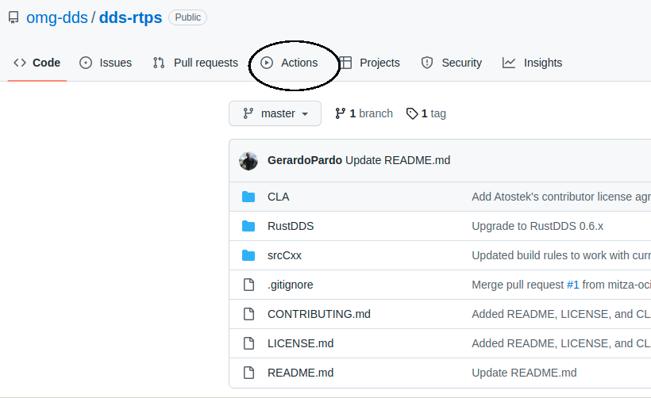

2. Go to *Testing Interoperability*.


3. Press *Run workflow*, select master branch (for the official tests).

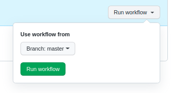

4. Wait a few minutes until the new task is finished and then press it.\
Example of a failed and a succeeded test:

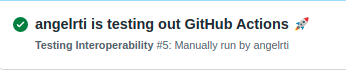


5. You will find something similar to this. At the bottom of the page
you will see an **Artifacts** section with the report generated.


6. Open it (the html file named `index.html`, inside `report`) and
you will have the html file generated. It will look something like this
(set pretty option):


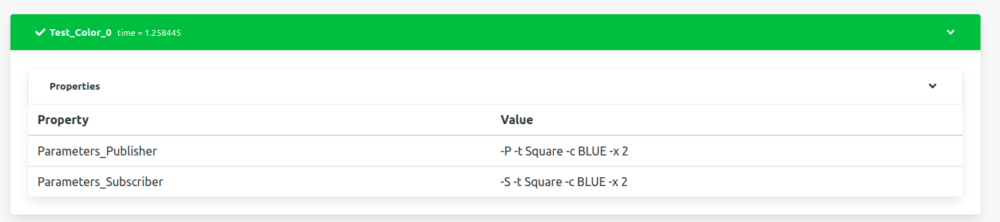

# Workflow

## Create Executable
## Upload Executable

Each vendor should compile their own version of their product with
the `shape_main.cxx` application. They should name the executable created as:
`<product_name>_shape_main_linux` and compress it into a `.zip.`

Example:


Then they should upload the executable to git in the following way:

> **Note**: to do it with the command line see `gh release`

1. In the main page, go to *Releases*.


2. Inside the latest release, go to *Edit*.


3. Upload the executables in *Attach binaries by dropping them here or
selecting them* (leave all the other fields as they were).
Keep marked *Set as the latest release*, and press *Update release*.


## Create a new release

### When to create a release

There are two cases when we will create a new release:
* Once a year \
    At the beginning of a new year we will create a new release.
    * Before creating the release we should:
        * Generate a report (see
          [Process of generating the report](#process-of-generating-the-report)).
        * Upload the report generated as an asset to the latest release
          (see
          [Process of uploading the executable](#process-of-uploading-the-executable)
          and follow the same steps but with the report
          instead than with the executable).
* When there is a new functionality in `shape_main.cxx`,
 `interoperability_report.py`, or the creation of any other file that
 could be considered as a new functionality.

Every time we create a new release we need to select which executables
we want to maintain in the new release. This new release should contain
the last version uploaded for every vendor.
The executables could also be uploaded (or removed) later.

### Release and tag name

The name of the release and the tag associated with it will be the same.
It should follow the next rule: \
`vx.y.z`
* x: major version
* y: minor version
* z: year

Depending on the importance of the changes from the old release to the new one,
it will be a major or a minor version change:
* New functionality, major change -> major version
* Bug fix or new functionality, minor change -> minor version


> Case of use: actual name -> `v1.0.2022`
> * If there is a small change in the repository: `v1.1.2022`
> * If there is a big change in the repository: `v2.0.2022`
> * At the beginning of a new year: `v1.0.2023`
>   * If last release was `v1.2.2022`, it would be `v1.2.2023`

### Process of creating the release

It is important that we set the release that we are creating as the
latest release, and that we do not create it as a pre-release.
Here it is explained how to create the release with the graphic interface.

> **Note**: to do it with the command line see `gh release` \
> You should also create the tag first. In order to do it:
> ~~~
> git checkout master
> git tag <tag_name>
> ~~~


The name of the release and the tag should be as explained in
[Release and tag name](#release-and-tag-name).

1. In the main page, go to *Releases*.


2. Go to *Draft a new release*.


3. Do:
    * In *Choose a tag* write the name of the tag and select
    *Create a new tag*.
    * Write the release name on *Release title*.
    * In *Describe this release* write: 'Creating release         `<name_release>`'.
    * Attach the executables in *Attach binaries by dropping them here or
      selecting them* (you can perform this step later: see
      [Process of uploading the executable](#process-of-uploading-the-executable)).
    * Mark *Set as the latest release*.
    * Make sure *Set as pre-release* is **not selected**.
    * Press *Publish release*.

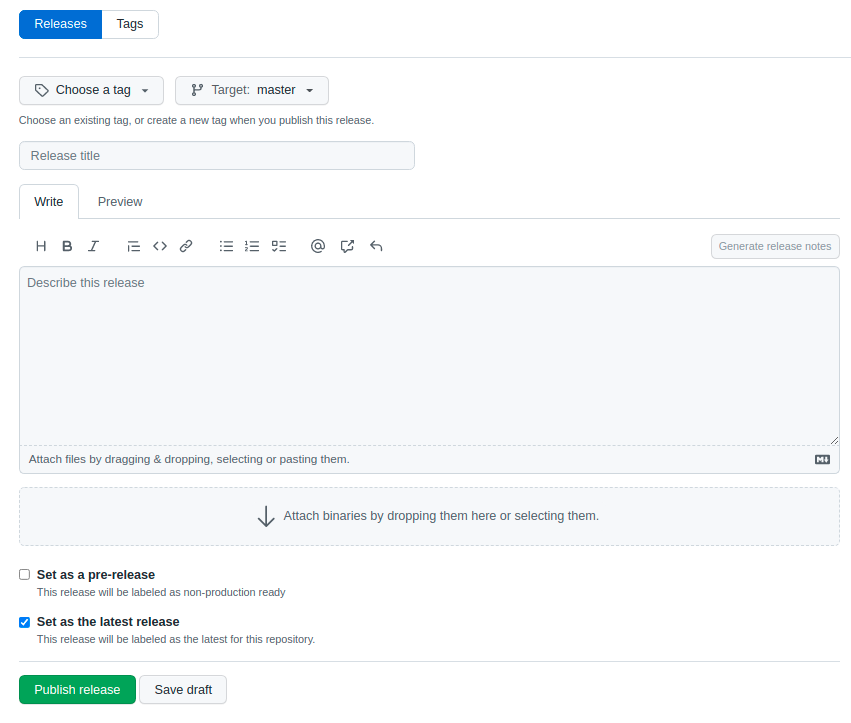


### Report

The status of the GitHub Action will be **Failure** (red color), if any of the
Test Cases that we are testing has an error, or **Success** (green color)
if none of them reported any error.

The report file will contain some items:
* **Test Suites**
    * The headers inside the report. There will be one for each combination
    of executables, including each executable with themselves.
    * They have some items:
        * Name: `<publisher>--<subscriber>`
        * Time: time spent in the execution of all the Test Cases
          inside the Test Suite.
        * Error tests (cross symbol): number of Test Cases with
          errors in the Test Suite.
        * Success tests (check symbol): number of succeeded Test Cases
          in the Test Suite.
        * A set of Test Cases.
* **Test Cases**
    * Test that we are testing.
    * They are green (success) or red (failure).
    * They have some items:
        * Name
        * Time: time spent in the execution of the Test Case.
        * Parameters Publisher
        * Parameters Subscriber
        * In case of error:
            * Expected code and code produced
            * Console output from the shape application publisher
            and subscriber.

## Report Bugs

In case of failure in any of the Test Cases, the vendors involved should
check first that the problem found is not generated by their executables.
If the cause of the problem is not known or it is believed to be generated
by other executables, they should report the problem as an issue
in the following way.
* Go to *Issues*.


* **Check the issue is not already submitted**.
* Select *New Issue*.


* Select Interoperability issue template, *Get Started*.


* Do:
    * Title: `Problem with <QoS or parameter>`
    * Fill the fields (publisher and subscriber name, Test Suite,
      Test Case, expected codes and produced codes).
    * Copy the link to the GitHub Action workflow run.
        * Example, from this page:

        

    * Add any suggestion about how to fix it, or why
      this is happening [Optional].
    * Add another comment [Optional].
    * In the section *Labels*, assign them to the vendors involved.

   
   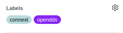

    * Press *Submit new issue*.

    

### How to create a label

In the case that your product does not appear in the labels of the repository
you should create it.

> **Note**: there is not one label for each version of the product,
but one for each product. \
> Example: for `connext611` and `connext700`, the label would be `connext`.


* To create it go to *Issues*, then to *Labels*.

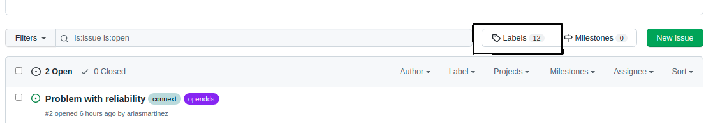


* Select *New Label*, and write the name of your product
(you can also change the color).

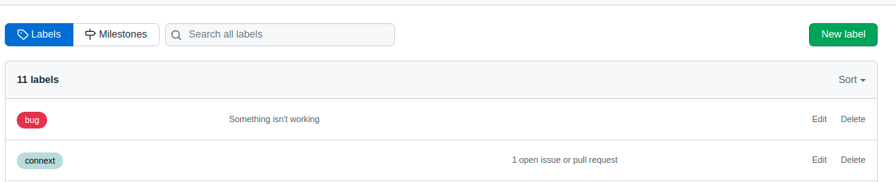

* Select *Create label*.

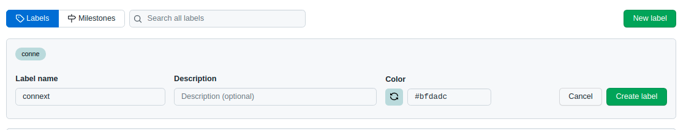


## Where can I find the last report?

At the beginning of the year the report from last year will be attached
as an asset to the last release. This means that for each year we will have
a report that is easily accessible and we will know which products
this report is related to (they are attached as assets).

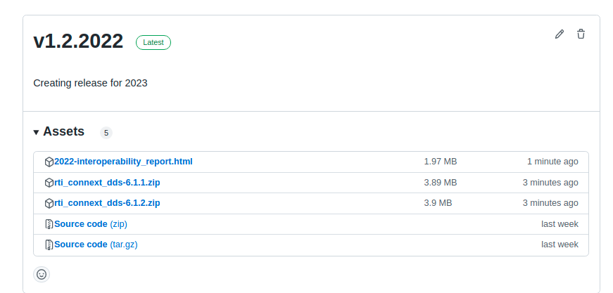


# How to make changes in the repository

To make changes in the repository you should test them before in your
own repository, and then do a pull request.

* **First make a fork**. Select *Fork*, and then *Create a new fork*.

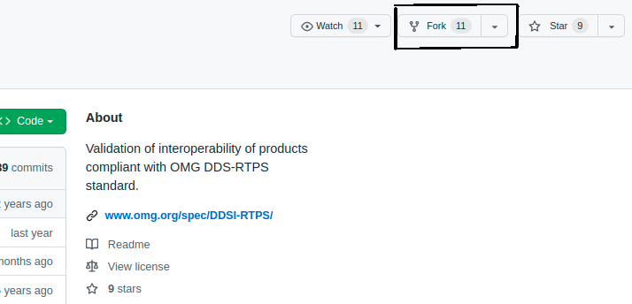

* Test all the changes you want to make in the repository.
* Do a pull request to the `omg-dds/dds-rtps` repository.
