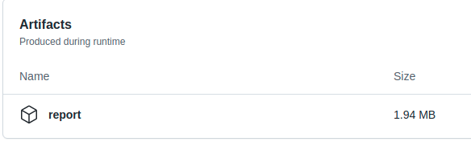

# dds-rtps

Validation of interoperability of products compliant with
[OMG DDS-RTPS standard](https://www.omg.org/spec/DDSI-RTPS/).
This is considered one of the core
[DDS Specifications](https://www.dds-foundation.org/omg-dds-standard/).
See https://www.dds-foundation.org/ for an overview of DDS.

The executables found on the
[release tab of this repository](https://github.com/omg-dds/dds-rtps/releases)
test discovery, DDS Topic and QoS matching, and interoperability for different
QoS settings. The goal is to validate that the implementations perform
these functions in compliance with OMG DDS-RTPS standard
and can interoperate with each other.

## Table of contents

* 1\. [Introduction](#introduction)

* 2\. [Run Interoperability Test Manually](#run-interoperability-test-manually)
    * 2.1. [Requirements](#requirements)

      * 2.1.1. [Using virtual environments](#using-virtual-environments)

        * 2.1.1.1. [Create virtual environment](#create-virtual-environment)

        * 2.1.1.2. [Activate virtual environment](#activate-virtual-environment)

        * 2.1.1.3. [Install requirements](#install-requirements)

    * 2.2. [Options of interoperability_report](#options-of-interoperability_report)

    * 2.3. [Example of use interoperability_report](#example-of-use-interoperability_report)

    * 2.4. [Report](#report)

* 3\. [Automation with GitHub Actions](#automation-with-github-actions)

* 4\. [Workflow](#workflow)

    * 4.1. [Create executable](#create-executable)

    * 4.2. [Upload executable](#upload-executable)

    * 4.3. [Create a new release](#create-a-new-release)

      * 4.1.1. [When to create a release](#when-to-create-a-release)

      * 4.1.2. [Release and tag name](#release-and-tag-name)

      * 4.1.3. [Process of creating the release](#process-of-creating-the-release)

    * 4.4. [Report Bugs](#report-bugs)

# Introduction

The script `interoperability_report.py` tests automatically the interoperability between two executables, generated with the `shape_main application`. The tests that the script runs must be defined previously in a python file following the next pattern:
~~~python
# test_suite_name = {
#   'test_name' : [[parameters], [expected_return_codes], <OPTIONAL>:function]
# }
# where:
#   * name: TestCase name (defined by us)
#   * parameters: list with shape_main application parameters
#   * expected_return_codes: list with expected ReturnCodes for a succeed test execution.
#   * function [OPTIONAL]: function to check how the Subscribers receives
#     the samples from the Publishers. By default it does not check
#     anything. The function has to be implemented by us.

# Example
rtps_test_suite_1 = {
  # one publisher with parameters [-t Square -x 2] and one subscriber with
  # [-t Square -c RED -x 2]. The publisher expected return code is OK
  # and the subscriber, DATA_NOT_RECEIVED
  'Test_Color_7' :  [['-P -t Square -x 2', '-S -t Square -c RED -x 2'],
                    [ReturnCode.OK, ReturnCode.DATA_NOT_RECEIVED]],
  # two publishers and one subscriber, all of them with expected return codes OK.
  'Test_DataRepresentation_0' : [['-P -t Square -x 1', '-P -t Square -x 1', '-S -t Square -x 1'],
                                [ReturnCode.OK, ReturnCode.OK, ReturnCode.OK]],
}
~~~
By default it will run the tests from `test_suite.py`.

Once the script finishes, it generates a report with the result
of the interoperability tests between both executables.

You can run the script either [automatically](#automation-with-github-actions) or [manually](#run-interoperability-test-manually).

# Run Interoperability Test Manually

## Requirements

- Python 3.8+
- Create and enable a virtual environment (installing requirements)

### Using virtual environments

The build will be done using virtual environments, you should create and
activate the virtual environment and then install all dependencies. This can be
done by following these steps:

#### Create virtual environment

In Linux® systems, you may need to install the corresponding python `venv`
package:

```
sudo apt install python3.8-venv
```

To create the virtual environment:

```
python3 -m venv .venv
```

#### Activate virtual environment

```
source .venv/bin/activate
```

#### Install requirements

This step is only required the first time or when the requirements change:

```
pip install -r requirements.txt
```
## Options of interoperability_report

The `interoperability_report.py` may configure the following options:

```
$ python3 interoperability_report.py -h

usage: interoperability_report.py [-h] -P publisher_name -S subscriber_name
                                  [-v]
                                  [-s test_suite_dictionary_file [test_suite_dictionary_file ...]]
                                  [-t test_cases [test_cases ...] | -d
                                  test_cases_disabled
                                  [test_cases_disabled ...]] [-o filename]

Validation of interoperability of products compliant with OMG DDS-RTPS
standard. This script generates automatically the verification between two
executables compiled with the shape_main application. It will generate a xml
report in a junit format.

optional arguments:
  -h, --help            show this help message and exit

general options:
  -P publisher_name, --publisher publisher_name
                        Path to the Publisher shape_main application. If the
                        executable is in the same folder as the script it
                        should contain the "./". Example:
                        ./rti_connext_dds-6.1.1_shape_main_linux
  -S subscriber_name, --subscriber subscriber_name
                        Path to the Subscriber shape_main application. If the
                        executable is in the same folder as the script it
                        should contain the "./". Example:
                        ./rti_connext_dds-6.1.1_shape_main_linux

optional parameters:
  -v, --verbose         Print debug information to stdout. It will track the
                        interoperability_report execution and it will show the
                        shape_main application output in case of error. By
                        default is non selected and the console output will be
                        the results of the tests.

Test Case and Test Suite:
  -s test_suite_dictionary_file [test_suite_dictionary_file ...], --suite test_suite_dictionary_file [test_suite_dictionary_file ...]
                        Test Suite that is going to be tested. Test Suite is a
                        file with a dictionary defined, it should be located
                        on the same directory as interoperability_report. By
                        default is test_suite. To call it do not write ".py",
                        only the name of the file. It will run all the
                        dictionaries defined in the file. Multiple files can
                        be passed.
  -t test_cases [test_cases ...], --test test_cases [test_cases ...]
                        Test Case that the script will run. By default it will
                        run all the Test Cases contained in the Test Suite.
                        This options is not supported with --disable_test.
  -d test_cases_disabled [test_cases_disabled ...], --disable_test test_cases_disabled [test_cases_disabled ...]
                        Test Case that the script will skip. By default it
                        will run all the Test Cases contained in the Test
                        Suite. This option is not supported with --test.

output options:
  -o filename, --output-name filename
                        Name of the xml report that will be generated. By
                        default the report name will be:
                        <publisher_name>-<subscriber_name>-date.xml If the
                        file passed already exists, it will add the new
                        results to it. In other case it will create a new
                        file.

```


## Example of use interoperability_report

This is an example that runs the `interoperability_report.py`
with the test suite `test_suite.py`

```
$ python3 interoperability_report.py -P <path_to_publisher_executable>
-S <path_to_subscriber_executable>
```

## Report

The script will generate a report file in JUnit (xml).

> **Note**: to visualize the report in a more friendly-human way you can use
`junit-viewer`: \
> `junit-viewer --results=<xml_name> --save=<html_name>`

The report file will contain some items:
* **Test Suites**
    * The headers inside the report.
    * They have some items:
        * Name: `<publisher>--<subscriber>`
        * Time: time spent in the execution of all the Test Cases
          inside the Test Suite.
        * Total error tests :x: : number of Test Cases with
          errors in the Test Suite.
        * Total success tests :heavy_check_mark: : number of successful Test Cases
          in the Test Suite.
        * A set of Test Cases.
* **Test Cases**
    * Test that we are testing.
    * They are green :heavy_check_mark: (success) or red :x: (failure).
    * They have some items:
        * Name
        * Time: time spent in the execution of the Test Case.
        * Parameters Publisher/Subscriber
        * In case of error:
            * Expected code and code produced
            * Console output from the shape application publisher
            and subscriber.

# Automation with GitHub Actions

GitHub Actions will call automatically the script `interoperability_report.py` and it will generate an `html` report.

We will trigger the process in the following cases:
  * With the upload of a new executable
  * When `interoperability_report.py` changes
  * When `test_suite.py` changes

To generate the report you should follow the next steps:
1. Go to *Actions*.


2. Go to *Testing Interoperability*.


3. Press *Run workflow*, select master branch (for the official tests).


4. Wait a few minutes until the new task is finished and then press it.\
Example of a successful and a failed test:


5. You will find something similar to this. At the bottom of the page
you will see an **Artifacts** section with the report generated.




6. Open it (the html file named `index.html`, inside `report`) and
you will have the report generated. It will look something like this
(set pretty option):


> **Note**: The status of the GitHub Action will be **Failure** :x:, if any of the
Test Cases that we are testing has an error, or **Success** :heavy_check_mark:
if none of them reported any error.
# Workflow

This section explains which are the events you may find in the process of maintaining
the repository.
## Create executable

The cases when we should create an executable are:

* With the release of a new version of the dds implementation
* When  `shape_main.cxx` changes. In this case there will be a new release version
  and, depending on the importance of the change, maybe the old executables are not
  compatible.

The steps to compile with `shape_main.cxx` are not defined but
there are some `makefiles` to help you with the task in the `srcCxx` folder.

> **Note**: to compile with `connext` you may want to use `makefile_rti_connext_dds_linux`.
## Upload executable

Each vendor should compile their own version of their product with
the `shape_main.cxx` application. They should name the executable created as:
`<product_name>_shape_main_linux` and compress it into a `.zip.`

Example:


Then they should upload the executable to git in the following way:

> **Note**: to do it with the command line see `gh release`

1. In the main page, go to *Releases*.


2. Inside the latest release, go to *Edit*.


3. Upload the executables in *Attach binaries by dropping them here or
selecting them* (leave all the other fields as they were).
Keep marked *Set as the latest release*, and press *Update release*.


> **Note**: when a new executable is uploaded we should generate a new report. To do it, go to [Automation with GitHub Actions](#automation-with-github-actions)
## Create a new release

### When to create a release

There are two cases when we will create a new release:
* Once a year \
    At the beginning of a new year we will create a new release.
    * Before creating the release we should:
        * Generate a report (see
          [Automation with GitHub Actions](#automation-with-github-actions)).
        * Upload the report generated as an asset to the latest release
          (see
          [Upload executable](#upload-executable)
          and follow the same steps but with the report
          instead than with the executable).
* When there is a new functionality in `shape_main.cxx`,
 `interoperability_report.py`, or the creation of any other file that
 could be considered as a new functionality.

Every time we create a new release we need to select which executables
we want to maintain in the new release. This new release should contain
the last version uploaded for every vendor.
The executables could also be uploaded (or removed) later.

### Release and tag name

The name of the release and the tag associated with it will be the same.
It should follow the next rule: \
`vx.y.z`
* x: major version
* y: minor version
* z: year

Depending on the importance of the changes from the old release to the new one,
it will be a major or a minor version change:
* New functionality, major change -> major version
* Bug fix or new functionality, minor change -> minor version


> Case of use: actual name -> `v1.0.2022`
> * If there is a small change in the repository: `v1.1.2022`
> * If there is a big change in the repository: `v2.0.2022`
> * At the beginning of a new year: `v1.0.2023`
>   * If last release was `v1.2.2022`, it would be `v1.2.2023`

### Process of creating the release

It is important that we set the release that we are creating as the
latest release, and that we do not create it as a pre-release.
Here it is explained how to create the release with the graphic interface.

> **Note**: to do it with the command line see `gh release` \
> You should also create the tag first. In order to do it:
> ~~~
> git checkout master
> git tag <tag_name>
> ~~~


The name of the release and the tag should be as explained in
[Release and tag name](#release-and-tag-name).

1. In the main page, go to *Releases*.


2. Go to *Draft a new release*.


3. Do:
    * In *Choose a tag* write the name of the tag and select
    *Create a new tag*.
    * Write the release name on *Release title*.
    * In *Describe this release* write: 'Creating release         `<name_release>`'.
    * Attach the executables in *Attach binaries by dropping them here or
      selecting them* (you can perform this step later: see
      [Upload executable](#upload-executable)).
    * Mark *Set as the latest release*.
    * Make sure *Set as pre-release* is **not selected**.
    * Press *Publish release*.


## Report Bugs

In case of failure in any of the Test Cases, the vendors involved should
check first that the problem found is not generated by their executables.
If the cause of the problem is not known or it is believed to be generated
by other executables, they should report the problem as an issue
in the following way.
* Go to *Issues*.


* **Check the issue is not already submitted**.
* Select *New Issue*.


* Select Interoperability issue template, *Get Started*.


* Do:
    * Title: `Problem with <QoS or parameter>`
    * Fill the fields (publisher and subscriber name, Test Suite,
      Test Case, expected codes and produced codes).
    * Copy the link to the GitHub Action workflow run.
        * Example, from this page:

        

    * Add any suggestion about how to fix it, or why
      this is happening [Optional].
    * Add another comment [Optional].
    * In the section *Labels*, assign them to the vendors involved.

   
   

    * Press *Submit new issue*.

    
