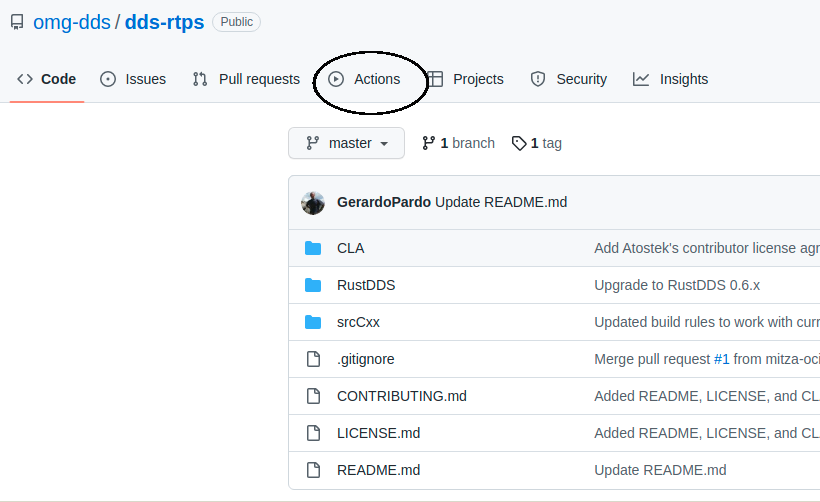
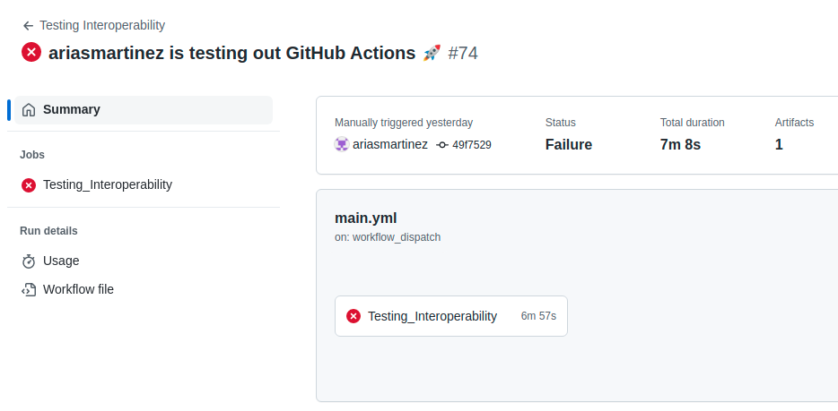
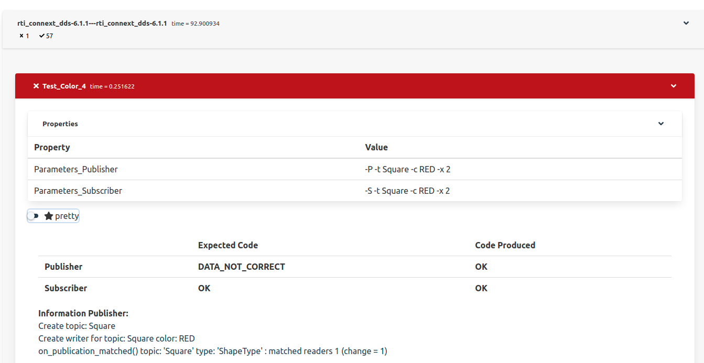
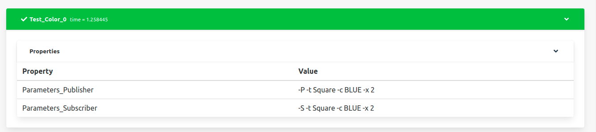
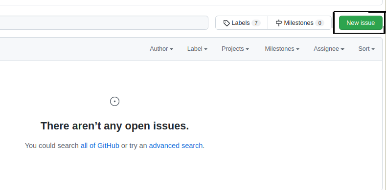
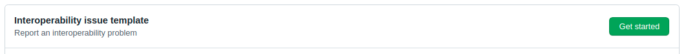
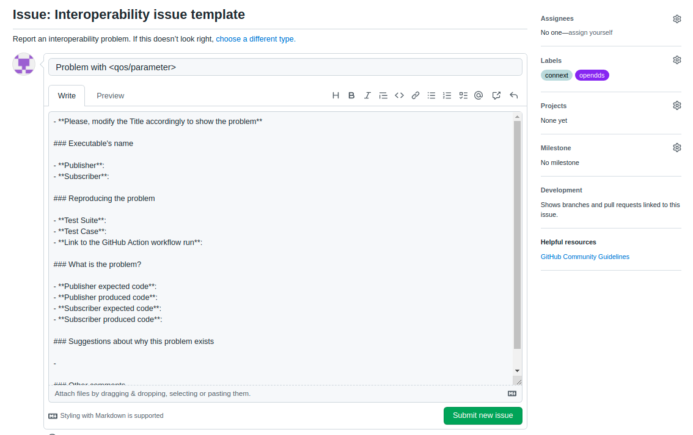
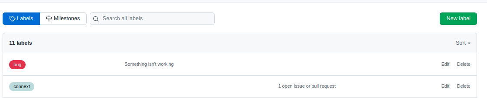
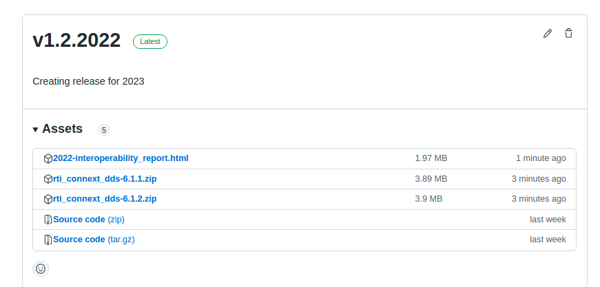

# Process of Compiling and Generating the Report

## Table of contents
1. [Introduction](#introduction)

2. [Create a release](#release)

    2.1. [When to create a release](#whenrelease)

    2.2. [Release and tag name](#releasename)

    2.3. [Process of creating the release](#createrelease)

3. [Process of uploading the executable](#executable)

4. [Process of generating the report](#generatereport)

    4.1.1. [How to delete a report](#deletereport)

    4.2 [Report](#report)

5. [Reporting failures](#failures)

    5.1. [How to create a label](#createlabel)

6. [How to make changes in the repository](#changes)

7. [Where can I find the last report?](#lastreport)

8. [Publish the report](#publishreport)

## Introduction 
The purpose of this documentation is to help the tasks of:
* Manage the repository
* Upload new products and generate reports
* Provide a way to report issues
* Make new changes in the repository
* Provide an easy way to get the last report

Regarding this we will have different sections:
* [Create a release](#release) is directed to the people in charge of the maintenance of the repository
* [Process of uploading the executable](#executable), [Process of generating the report](#generatereport) and [Reporting failures](#failures) are directed to the vendors who want to upload their products to the repository
* [How to make changes in the repository](#changes) is directed to the people who want to add new functionalities to the repository
* [Where can I find the last report](#lastreport) and [Publish the report](#publishreport) are directed to the people who only want to access the interoperability report

## Create a release 

### When to create a release 

There are two cases when we will create a new release:
* Once a year \
    At the beginning of a new year we will create a new release.
    * Before creating the release we should:
        * Generate a report (see [Process of generating the report](#generatereport))
        * Upload the report generated as an asset to the latest release (see [Process of uploading the executable](#executable) and follow the same steps but with the report instead than with the executable)
* When there is a new functionality in shape_main.cxx, interoperability_report.py, or the creation of any other file that could be considered as a new functionality.

Every time we create a new release we need to select which executables we want to maintain in the new release. This new release should contain the last version uploaded for every vendor. The executables could also be uploaded (or removed) later.

### Release and tag name 

The name of the release and the tag associated with it will be the same. It should follow the next rule:
vx.y.z
* x: major version
* y: minor version
* z: year

Depending on the importance of the changes from the old release to the new one, it will be a major or a minor version change:
* New functionality, major change -> major version
* Bug fix or new functionality, minor change -> minor version

Case of use: actual_name: v1.0.2022
* If there is a small change in the repository: v1.1.2022
* If there is a big change in the repository: v2.0.2022
* At the beginning of a new year: v1.0.2023
    * If last release was v1.2.2022, it would be v1.2.2023

### Process of creating the release 

It is important that we set the release that we are creating as the latest release, and that we do not create it as a pre-release.
Here it is explained how to create the release with the graphic interface.
~~~
Note: to do it with the command line see gh release
You should also create the tag first. In order to do it:
* Go to the main branch
git checkout master
git tag <tag_name>
git push --tags
~~~
The name of the release and the tag should be as explained in [Release and tag name](#releasename)

1. In the main page, go to Releases

2. Go to draft a new release

3. Do:
    * In choose a tag: write the name of the tag and select create a new tag
    * Write the release name on release title
    * In Describe the release write: Creating release <name_release>
    * Attach the executables in 'Attach binaries by dropping them here or selecting them' (you can perform this step later: see [Process of uploading the executable](#executable))
    * Mark Set as the latest release
    * Make sure Set as pre-release is not selected
    * Press publish release

## Process of uploading the executable 

Each vendor should compile their own version of their product with the shape_main.cxx application. They should name the executable created as: <product_name>_shape_main_linux and compress it into a .zip.

Example:

Then they should upload the executable to git in the following way:
~~~
To do it with the command line see gh release
~~~
1. In the main page, go to Releases

2. Inside the latest release, go to Edit.

3. Upload the executables in 'Attach binaries by dropping them here or selecting them' (leave all the other fields as they were). Keep marked 'Set as the latest release', and press update release.

## Process of generating the report 

A new report can be generated in any case, but it should be done when a change is made in the latest release, i.e when a new executable is uploaded.
To generate the report you should follow the next steps:
1. Go to Actions

2. Go to Testing Interoperability

3. Press Run workflow, select master branch (for the official tests)

4. Wait a few minutes until the new task is finished and the press it.\
Example of a failed and a succeeded test:

5. You will find something similar to this. At the bottom of the page you will see an Artifacts section with the report generated.

6. Open it (the html file named index.html, inside report) and you will have the html file generated. It will look something like this (set pretty option):

#### **How to delete a report** 

In the case that you made a mistake uploading the executable and the report generated is not valid or that you want to delete an old report you can do it by deleting the workflow run. In order to do it:

* In Actions, select the GitHub Action workflow run you want to delete, and delete it.

### Report 

The status of the GitHub Action will be Failure (red color), if any of the Test Cases that we are testing has an error, or Success (green color) if none of them reported any error.

The report file will contain some items:
* Test Suites
    * The headers inside the report. There will be one for each combination of executables, including each executable with themselves.
    * They have some items:
        * Name: <publisher>--<subscriber>
        * Time: time spent in the execution of all the Test Cases inside the Test Suite.
        * Error tests (cross symbol): number of Test Cases with errors in the Test Suite
        * Success tests (check symbol): number of succeeded Test Cases in the Test Suite
        * A set of Test Cases
* Test Cases
    * Test that we are testing
    * They are green (success) or red (failure)
    * They have some items:
        * Name
        * Time: time spent in the execution of the Test Case
        * Parameters Publisher
        * Parameters Subscriber
        * In case of error:
            * Expected code and code produced
            * Console output from the shape application publisher and subscriber

## Reporting failures 

In case of failure in any of the Test Cases, the vendors involved should check first that the problem found is not generated by their executables. If the cause of the problem is not known or it is believed to be generated by other executables, they should report the problem as an issue in the following way.
* Go to Issues

* Check the issue is not already submitted
* Select New Issue

* Select Interoperability issue template, Get Started

* Do:
    * Title: Problem with <QoS or parameter where the problem was found>
    * Fill the fields (publisher and subscriber name, Test Suite, Test Case, expected codes and produced codes)
    * Copy the link to the GitHub Action workflow run
        * Example:

        

    * Add any suggestion about how to fix it, or why this is happening [Optional]
    * Add another comment [Optional]
    * In the section Labels, assign them to the vendors involved

   
   

    * Press Submit new issue

    

### How to create a label 

In the case that your product does not appear in the labels of the repository you should create it.
~~~
There is not one label for each version of the product, but one for each product.
Example: for connext611 and connext700, the label would be connext
~~~

* To create it go to Issues, then to Labels

* Select New Label, and write the name of your product (you can also change the color)

* Select Create label

## How to make changes in the repository 

To make changes in the repository you should test them before in your own repository, and then do a pull request.

* First make a fork. Select Fork, and then Create a new fork.

* Test all the changes you want to make in the repository
* Do a pull request to the omg-dds/dds-rtps repository

## Where can I find the last report? 

At the beginning of the year the report from last year will be attached as an asset to the last release. This means that for each year we will have a report that is easily accessible and we will know which products this report is related to (they are attached as assets).

## Publish the report 